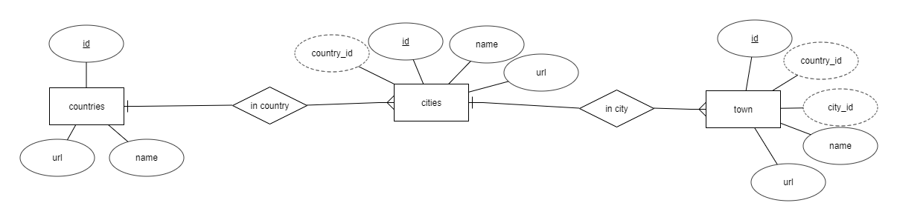

# Country-City-Town-DB
A relational database and set of hierarchical json files for countries, cities and towns.

This repository holds a collection of town list which is collected from internet, so there can be some missing towns in the list.

Let's have a look into the project structure

* json_files
  * countries.json : list of countries
  * [COUNTRY_URL]
      * cities.json : list of cities in the [COUNTRY_NAME]
      * [CITY\_NAME] : list of counties in the [CITY\_NAME] 
* sqlite
  * locals.db : an SQLite database file which is modelled like in the ER diagram you can see below	 
* images  
	contains images used for this readme file.

